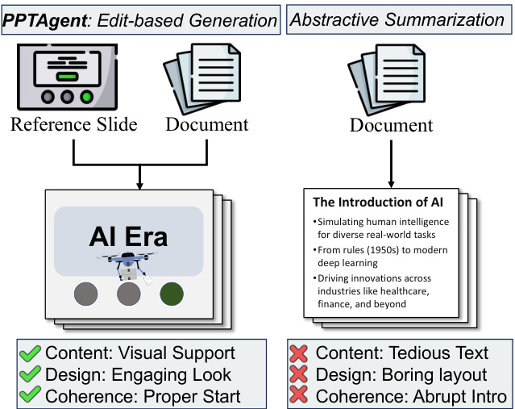
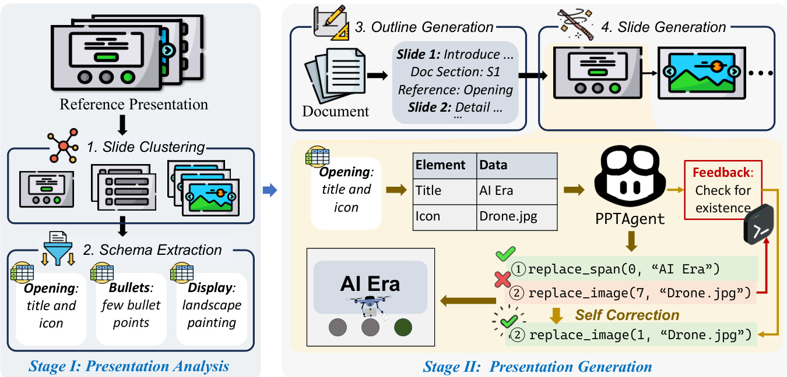
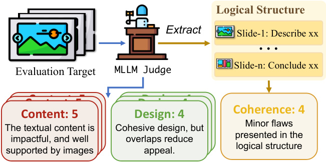
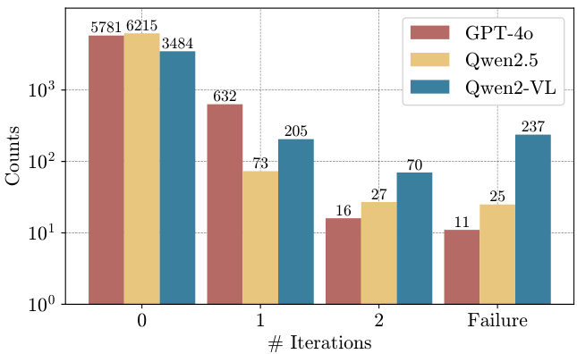
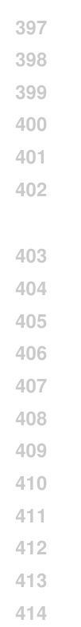
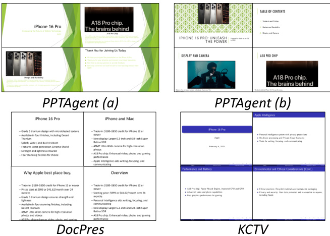
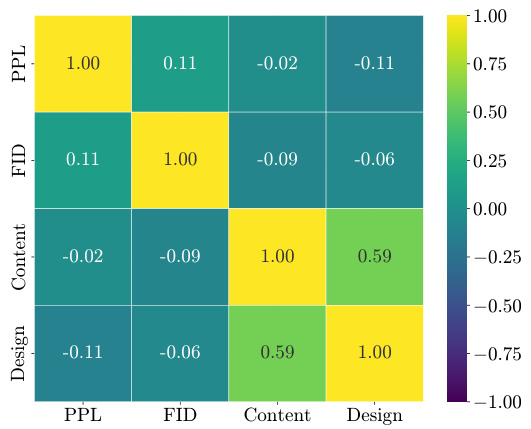

# PPTAGENT: Generating and Evaluating Presentations Beyond Text-to-Slides

# Abstract

Automatically generating presentations from documents is a challenging task that requires accommodating content quality, visual appeal, and structural coherence. Existing methods primarily focus on improving and evaluating the content quality in isolation, overlooking visual appeal and structural coherence, which limits their practical applicability. To address these limitations, we propose PPTAGENT, which comprehensively improves presentation generation through a two-stage, edit-based approach inspired by human workflows. PPTAGENT first analyzes reference presentations to extract slide-level functional types and content schemas, then drafts an outline and iteratively generates editing actions based on selected reference slides to create new slides. To comprehensively evaluate the quality of generated presentations, we further introduce PPTEVAL, an evaluation framework that assesses presentations across three dimensions: Content, Design, and Coherence. Results demonstrate that PPTAGENT significantly outperforms existing automatic presentation generation methods across all three dimensions.

# 1 Introduction

Presentations are a widely used medium for information delivery, valued for their visual effectiveness in engaging and communicating with audiences. However, creating high-quality presentations requires a captivating storyline, well-designed layouts, and rich, compelling content (Fu et al., 2022). Consequently, creating well-rounded presentations requires advanced presentation skills and significant effort. Given the inherent complexity of the presentation creation, there is growing interest in automating the presentation generation process (Ge et al., 2025; Maheshwari et al., 2024; Mondal et al., 2024) by leveraging the generalization capabilities of Large Language Models (LLMs) and Multimodal Large Language Models (MLLMs).

Figure 1: Comparison between our PPTAGENT approach (left) and the conventional abstractive summarization method (right).

Existing methods for presentation generation typically adhere to a text-to-slides paradigm (Mondal et al., 2024; Sefid et al., 2021), wherein generated text is converted into slides relying on a limited set of human-defined rules or templates. As illustrated in Figure 1, this approach often simplifies the task to an extension of abstractive summarization (Mondal et al., 2024; Sefid et al., 2021) and operates without holistic planning. Consequently, the resulting presentations are often text-heavy and fragmented, thus failing to engage audiences (Barrick et al., 2018), underscoring the necessity to broaden the scope and depth of aspects considered in presentation generation research.

Rather than creating complex presentations from scratch, human workflows typically involve selecting exemplary slides as references and then transferring key content onto them (Duarte, 2010). However, enabling LLMs to adopt this edit-based paradigm for presentation generation poses several challenges. First, the inherent functional diversity and layout complexity of presentations make it difficult for LLMs to directly determine which slides should be referenced. Second, most presentations are saved in PowerPoint’s verbose and redundant XML format (Gryk, 2022), as demonstrated in Figure 11, which hinders LLMs from performing robust editing operations. This gap between real-world demands for interactive presentation editing and the limitations of LLMs in understanding and manipulating presentations raises an intriguing question: Can we devise an agentic workflow that achieves human-level effectiveness with the edit-based paradigm?

Figure 2: Overview of the PPTAGENT workflow. StageI: Presentation Analysis involves analyzing the reference presentation to cluster slides into groups and extract their content schemas. Stage II: Presentation Generation generates new presentations guided by the outline, incorporating self-correction mechanisms to ensure robustness.

In this work, we propose PPTAGENT, which addresses these challenges in two stages. In stage I, we analyze reference presentations to extract slide-level functional types (which classify slides by purpose or layout pattern) and their content schemas, facilitating subsequent reference selection and slide generation. To preserve rich details within slides and enable fine-grained modifications for handling presentation complexity (Wang et al., 2024b), we introduce a suite of APIs that operate on HTML-rendered slides. In Stage II, LLMs utilize these APIs to simplify slide modifications through code interaction. Moreover, we introduce a selfcorrection mechanism that allows LLMs to refine their output using execution failures as feedback, thereby ensuring the robustness of the generation process (Kamoi et al., 2024). As shown in Figure 2, we first cluster the reference slides into categories (e.g., “Opening”) and extract their content schemas. In the next stage, the LLM plans the new slides by constructing a presentation outline that defines each one’s purpose (e.g., Slide 1 to “Introduce the presentation topic”), content source, and reference slide. For each slide, PPTAGENT produces a series of editing actions (e.g., replace_span) to transfer the content, which is generated under the guidance of the content schema, onto the slide.

Due to the lack of a comprehensive evaluation framework, we propose PPTEVAL, which adopts the MLLM-as-a-judge paradigm (Chen et al., 2024a) to evaluate presentations across three dimensions: Content, Design, and Coherence(Duarte, 2010). Human evaluations validate the reliability and effectiveness of PPTEVAL. Results demonstrate that PPTAGENT generates highquality presentations, achieving an average score of 3.67 for the three dimensions in PPTEVAL.

Our main contributions can be summarized as follows:

We propose PPTAGENT, a framework that redefines automatic presentation generation as an edit-based process guided by reference presentations.

We introduce PPTEVAL, a comprehensive evaluation framework that assesses presentations across three dimensions: Content, Design, and Coherence.

We release the PPTAGENT and PPTEVAL codebases, along with a new presentation dataset Zenodo10K, to support future research1.

# 2 PPTAGENT

In this section, we formulate the presentation generation task and introduce our proposed PPTAGENT framework, which consists of two distinct stages. In stage I, we analyze reference presentations through slide clustering and schema extraction, providing a comprehensive understanding of reference presentations that facilitates subsequent reference selection and slide generation. In stage II, we leverage the comprehension of reference presentations to select reference slides and generate the target presentation for the input document through an iterative editing process. An overview of our workflow is illustrated in Figure 2.

# 2.1 Problem Formulation

PPTAGENT is designed to generate an engaging presentation through an edit-based process. We provide formal definitions for the conventional method and PPTAGENT to highlight their key differences.

Conventional methods (Bandyopadhyay et al., 2024; Mondal et al., 2024) for creating each slide $\boldsymbol{s}$ is formalized in Equation 1. Given the input content $C$ , models generates $n$ slide elements $e_{i}$ , each defined by its type, content, and styling attributes, such as (Textbox, "Hello", $\{\mathrm{size,position,...\}})$ .

$$
S=\{e_{1},e_{2},\ldots,e_{n}\}=f(C)
$$

While this conventional method is straightforward, it requires manual specification of styling attributes, which is challenging for automated generation (Guo et al., 2023). Instead of creating slides from scratch, PPTAGENT generates a sequence of executable actions to edit reference slides, thereby preserving their well-designed layouts and styles. As shown in Equation 2, given the input content $C$ and the $j$ -th reference slide $R_{j}$ , which is selected from the reference presentation, PPTAGENT generates a sequence of $m$ executable actions, where each action $a_{i}$ corresponds to a line of executable code.

$$
A=\{a_{1},a_{2},\ldots,a_{m}\}=g(C,R_{j})
$$

# 2.2 Stage I: Presentation Analysis

In this stage, we analyze the reference presentation to guide the reference selection and slide generation. Firstly, we categorize slides based on their structural and layout characteristics through slide clustering. Then, we model the content structure of slides within each cluster into a defined content schema, which provides a comprehensive description of its constituent elements.

Slide Clustering Slides can be categorized into two main types based on their functionalities: structural slides that support the presentation’s organization (e.g., opening slides) and content slides that convey specific information (e.g., bullet-point slides). To distinguish between these two types, we employ LLMs to segment the presentation accordingly. For structural slides, we leverage LLMs’ long-context capability to analyze all slides in the reference presentation, identifying structural slides, labeling their structural roles based on their textual features, and grouping them accordingly. For content slides, we first convert them into images and then apply a hierarchical clustering approach to group similar slide images. Subsequently, we utilize MLLMs to analyze the converted slide images, identifying layout patterns within each cluster. Further details are provided in Appendix D.

Schema Extraction After clustering, we further analyzed their content schemas to facilitate the slide generation. Specifically, we define an extraction framework where each element is represented by its category, description, and content. This framework enables a clear and structured representation of each slide. Detailed instructions are provided in Appendix F, with an example of the schema shown below.

Table 1: Example of the extracted content schema.

<html><body><table><tr><td>Category</td><td>Description</td><td>Data</td></tr><tr><td>Title</td><td>Main title</td><td>Sample Library</td></tr><tr><td>Date</td><td>Date of the event</td><td>15 February 2018</td></tr><tr><td>Image</td><td>Pristay ine se te</td><td>Piatyre: Children in a li-</td></tr></table></body></html>

# 2.3 Stage II: Presentation Generation

PPTAGENT first holistically plans by generating a detailed presentation outline. Guided by this, it then iteratively edits selected reference slides using the provided APIs to create the target presentation

Outline Generation As shown in Figure 2, we utilize LLMs to construct a structured presentation outline of multiple entries, with each entry specifying the new slide’s purpose, its reference slide, and relevant content to be retrieved from the input document. This planning process utilizes the LLM’s understanding of slide functionality (from Stage I) and its grasp of the input document’s structure and available images (via captions). Such detailed upfront planning ensures generated slides are contextually appropriate, thereby contributing to the overall coherence of the presentation.

Slide Generation Guided by the presentation outline from the previous phase, slides are generated iteratively. For each new slide, the LLM leverages text and image captions retrieved from the input document to produce the content of the new slide, under the guidance of the content schema. Subsequently, the LLM transfers the content onto the selected reference slide, thus ensuring the generated slide adopts the layout of the reference slide while maintaining consistency in content structure.

Specifically, we provide a suite of APIs to enable LLMs to edit the reference slide. As shown below, these APIs support granular operations like editing, removing, or duplicating slide elements. Moreover, given that direct LLM interaction with verbose and complex presentation XML can be unreliable, we render reference slides into an HTML representation (demonstrated in Figure 10) for a more precise and intuitive structure. This LLMfriendlier HTML format (Feng et al., 2024), combined with our provided APIs, crucially enables accurate programmatic editing by the LLM.

Table 2: Definition and function of the provided APIs.

<html><body><table><tr><td>Function Name</td><td>Description</td></tr><tr><td>del_span</td><td>Delete a span.</td></tr><tr><td>del_image</td><td>Delete an image element.</td></tr><tr><td>clone_paragraph</td><td>Clone an existing paragraph.</td></tr><tr><td>replace_span</td><td>Replace the content of a span.</td></tr><tr><td>replace_image</td><td>Replace the source of image.</td></tr></table></body></html>

Furthermore, to enhance the robustness of the editing process, we implement a self-correction mechanism (Kamoi et al., 2024). We execute generated editing actions within a REPL2 environment. When actions fail to apply to reference slides, the REPL provides execution feedback3 to assist LLMs in refining their actions. The LLM then analyzes this feedback and adjusts its editing actions (Guan et al., 2024; Wang et al., 2024b), enabling iterative refinement until a valid slide is generated or the maximum retry limit is reached.

# 3 PPTEVAL

We introduce PPTEVAL, a comprehensive framework that evaluates presentation quality from multiple dimensions, addressing the absence of labelfree evaluation for presentations. The framework provides both numeric scores (1-to-5 scale) and detailed rationales to justify its assessment.

Figure 3: PPTEVAL assesses presentations from three dimensions: content, design, and coherence.

Grounded in established presentation design principles (Duarte, 2008, 2010), our evaluation framework focuses on three key dimensions, as summarized in Table 3. Specifically, given a presentation, we assess the content and design at the slide level, while evaluating coherence across the entire presentation. The complete evaluation process is illustrated in Figure 3, with representative examples, and details of scoring criteria and human agreement evaluation are provided in Appendix C.

Table 3: The scoring criteria of dimensions in PPTEVAL, all evaluated in 1-5 scale.

<html><body><table><tr><td>Dimension</td><td>Criteria</td></tr><tr><td>Content</td><td>Text should be concise and grammatically sound, supported by relevant images.</td></tr><tr><td>Design</td><td>Harmonious colors and proper layout ensure readability, while visual elements like geo- metric shapes enhance the overall appeal.</td></tr><tr><td>Coherence</td><td>Structure develops progressively, incorpo- rating essential background information.</td></tr></table></body></html>

# 4 Experiment

In this section, we conduct a series of experiments to answer the following research questions:

RQ1: Does PPTAGENT, as an edit-based approach, outperform existing baselines? RQ2: Does PPTAGENT leverage the reference presentation effectively? RQ3: How can presentations be evaluated reliably and comprehensively?

# 4.1 Dataset

Existing presentation datasets, such as Fu et al. (2022); Mondal et al. (2024); Sefid et al. (2021); Sun et al. (2021), have two main issues. First, they are mostly stored in PDF or JSON formats, which leads to a loss of semantic information, such as structural relationships and styling attributes of elements. Furthermore, these datasets mainly consist of academic presentations on artificial intelligence, which limits their diversity. To address these limitations, we introduce Zenodo10K, a new dataset sourced from Zenodo (European Organization For Nuclear Research and OpenAIRE, 2013), which hosts various artifacts across domains, all under clear licenses. We have curated 10,448 presentations from this source and made them publicly available to support further research.

Table 4: Statistics of the dataset used in our experiments, detailing the number of characters (‘#Chars’) and figures (‘#Figs’), as well as the number of pages (‘#Pages’).

<html><body><table><tr><td rowspan="2">Domain</td><td colspan="2">Document</td><td colspan="3">Presentation</td></tr><tr><td>#Chars</td><td>#Figs</td><td>#Chars</td><td>#Figs</td><td>#Pages</td></tr><tr><td>Culture</td><td>12,708</td><td>2.9</td><td>6,585</td><td>12.8</td><td>14.3</td></tr><tr><td>Education</td><td>12,305</td><td>5.5</td><td>3,993</td><td>12.9</td><td>13.9</td></tr><tr><td>Science</td><td>16,661</td><td>4.8</td><td>5,334</td><td>24.0</td><td>18.4</td></tr><tr><td>Society</td><td>13,019</td><td>7.3</td><td>3,723</td><td>9.8</td><td>12.9</td></tr><tr><td>Tech</td><td>18,315</td><td>11.4</td><td>5,325</td><td>12.9</td><td>16.8</td></tr></table></body></html>

Following Mondal et al. (2024), from each of the five domains, we sampled 10 input documents (to serve as the source of content) and 10 reference presentations (to provide stylistic and structural guidance). This dataset composition yields 500 presentation generation tasks per experimental configuration (5 domains $\times10$ input documents $\times10$ reference presentations). Table 4 provides overall dataset statistics, with detailed sampling criteria and preprocessing steps provided in Appendix A

# 4.2 Implementation Details

PPTAGENT is implemented with three models: GPT-4o-2024-08-06 (GPT-4o), Qwen2.5-72BInstruct (Qwen2.5, Yang et al., 2024), and Qwen2- VL-72B-Instruct (Qwen2-VL, Wang et al., 2024a). These models, categorized by the modality (textual or visual) they handle as indicated by subscripts, are further combined into configurations consisting of a language model (LM) and a vision model (VM), such as $\mathrm{Qwen}2.5_{L M}+\mathrm{Qwen}2-\mathrm{VL}_{\mathsf{V M}}$ . Each slide generation allows a maximum of two selfcorrection iterations. We use Chen et al. (2024b) and Wu et al. (2020) to compute the text and image embeddings respectively. All open-source LLMs are deployed using the VLLM framework (Kwon et al., 2023) on NVIDIA A100 GPUs. The total computational cost for experiments is approximately 500 GPU hours.

# 4.3 Baselines

We choose the following baseline methods:

DocPres (Bandyopadhyay et al., 2024) proposes a rule-based approach that generates narrative-rich slides through multi-stages, and incorporates images through a similarity-based mechanism.

KCTV (Cachola et al., 2024) proposes a template-based method that creates slides in an intermediate format before converting them into final presentations using predefined templates.

The baseline methods operate without vision models since they do not process visual information. Each configuration generates 50 presentations (5 domains $\times10$ input documents), as they require predefined templates instead of reference presentations. Consequently, the FID metric is excluded from their evaluation.

# 4.4 Evaluation Metrics

We evaluated the presentation generation using the following metrics:

Success Rate (SR) evaluates the robustness of presentation generation (Wu et al., 2024), calculated as the percentage of successfully completed tasks. For PPTAGENT, success requires the generation of all slides without execution errors after self-correction. For KCTV, success is determined by the successful compilation of the generated LaTeX file. DocPres is excluded from this evaluation due to its deterministic rule-based conversion.

Perplexity (PPL) measures the likelihood of the model generating the given sequence. Using Llama-3-8B (Dubey et al., 2024), we calculate the average perplexity across all slides in a presentation. Lower perplexity scores indicate higher textual fluency (Bandyopadhyay et al., 2024).

Rouge-L (Lin, 2004) evaluates textual similarity by measuring the longest common subsequence. While ROUGE typically needs golden labels, we use original documents as reference to test its effectiveness in their absence. We report the F1 score, and subsequently analyze its effectiveness.

FID (Heusel et al., 2017) measures the visual similarity between the generated presentation and the reference presentation in the feature space.

PPTEVAL employs GPT-4o to evaluate presentation quality across three dimensions: content, design, and coherence. We compute content and design scores by averaging across slides, while coherence is assessed at the presentation level.

# 4.5 Improvement by PPTAGENT (RQ1)

PPTAGENT Significantly Improves Overall Presentation Quality. PPTAGENT demonstrates statistically significant performance improvements over baseline methods across all three dimensions of PPTEVAL. Compared to the rule-based baseline (DocPres), PPTAGENT exhibits substantial improvements in both design and content dimensions (3.34 vs. 2.37, $+40.9\%$ ; 3.34 vs. 2.98, $+12.1\%)$ , as presentations generated by the DocPres method show minimal visual appeal. In comparison with the template-based baseline (KCTV), PPTAGENT also achieves notable improvements in both design and content (3.34 vs. 2.95, $+13.2\%$ ; 3.28 vs. 2.55, $+28.6\%$ , underscoring the efficacy of the editbased paradigm. Most notably, PPTAGENT shows a significant enhancement in the coherence dimension (4.48 vs. 3.57, $+25.5\%$ for DocPres; 4.48 vs. 3.28, $+36.6\%$ for KCTV). This improvement can be attributed to PPTAGENT ’s comprehensive analysis of the structural role of slides.

<html><body><table><tr><td colspan="2">Configuration</td><td colspan="4">Existing Metrics</td><td colspan="4">PPTEVAL</td></tr><tr><td>Language Model</td><td>Vision Model</td><td>SR(%)↑</td><td>PPL↓</td><td>ROUGE-L↑</td><td>FID↓</td><td>Content↑</td><td>Design↑</td><td>Coherence↑</td><td>Avg.↑</td></tr><tr><td colspan="10">DocPres (rule-based)</td></tr><tr><td>GPT-40LM</td><td>一</td><td>一</td><td>76.42</td><td>13.28</td><td>一</td><td>2.98</td><td>2.33</td><td>3.24</td><td>2.85</td></tr><tr><td>Qwen2.5LM</td><td>一</td><td>一</td><td>100.4</td><td>13.09</td><td></td><td>2.96</td><td>2.37</td><td>3.28</td><td>2.87</td></tr><tr><td colspan="10">KCTV (template-based)</td></tr><tr><td>GPT-40LM</td><td></td><td>80.0</td><td>68.48</td><td>10.27</td><td>一</td><td>2.49</td><td>2.94</td><td>3.57</td><td>3.00</td></tr><tr><td>Qwen2.5LM</td><td>一</td><td>88.0</td><td>41.41</td><td>16.76</td><td>一</td><td>2.55</td><td>2.95</td><td>3.36</td><td>2.95</td></tr><tr><td colspan="10">PPTAGENT (ours)</td></tr><tr><td>GPT-40LM</td><td>GPT-40vM</td><td>97.8</td><td>721.54</td><td>10.17</td><td>7.48</td><td>3.25</td><td>3.24</td><td>4.39</td><td>3.62</td></tr><tr><td>Qwen2-VLLM</td><td>Qwen2-VLvM</td><td>43.0</td><td>265.08</td><td>13.03</td><td>7.32</td><td>3.13</td><td>3.34</td><td>4.07</td><td>3.51</td></tr><tr><td>Qwen2.5LM</td><td>Qwen2-VLVM</td><td>95.0</td><td>496.62</td><td>14.25</td><td>6.20</td><td>3.28</td><td>3.27</td><td>4.48</td><td>3.67</td></tr></table></body></html>

Table 5: Performance comparison of presentation generation methods, including DocPres, KCTV, and our proposed PPTAGENT. The best/second-best scores are bolded/underlined. Results are reported using existing metrics, including Success Rate (SR), Perplexity (PPL), Rouge-L, Fréchet Inception Distance (FID), and PPTEVAL.

Figure 4: The number of iterative self-corrections required to generate a single slide under different models.

PPTAGENT Exhibits Robust Generation Performance. Our approach empowers LLMs to produce well-rounded presentations with a remarkable

<html><body><table><tr><td>Setting</td><td>SR(%)</td><td>Content</td><td>Design</td><td>Coherence</td><td>Avg.</td></tr><tr><td colspan="6">Ablation Studies</td></tr><tr><td>PPTAGENT</td><td>95.0</td><td>3.28</td><td>3.27</td><td>4.48</td><td>3.67</td></tr><tr><td>w/o Outline</td><td>91.0</td><td>3.24</td><td>3.30</td><td>3.36</td><td>3.30</td></tr><tr><td>w/o Schema</td><td>78.8</td><td>3.08</td><td>3.23</td><td>4.04</td><td>3.45</td></tr><tr><td>w/o Structure</td><td>92.2</td><td>3.28</td><td>3.25</td><td>3.45</td><td>3.32</td></tr><tr><td>w/o CodeRender</td><td>74.6</td><td>3.27</td><td>3.34</td><td>4.38</td><td>3.66</td></tr><tr><td colspan="6">Controlled Experiments</td></tr><tr><td>Controlled</td><td>100.0</td><td>3.21</td><td>3.60</td><td>4.27</td><td>3.69</td></tr><tr><td>KCTV</td><td>88.0</td><td>2.55</td><td>2.95</td><td>3.36</td><td>2.95</td></tr><tr><td>Human</td><td>-</td><td>4.01</td><td>3.95</td><td>4.28</td><td>4.08</td></tr></table></body></html>

Table 6: Ablation studies and controlled experiments for PPTAGENT with the Qwen $2.5_{L M}+\mathrm{Qwen}2-\mathrm{VL}_{\mathsf{V M}}$ configuration, illustrating the impact of each component. “Controlled” denotes PPTAGENT evaluated with the same template as KCTV, but without human annotations. “Human” represents the performance of presentations authored by humans.

success rate, achieving $\geq95\%$ success rate for both Qwen $2.5_{\mathsf{L M}}$ and GPT- $40_{\mathsf{L M}}$ , which is a significant improvement compared to KCTV $(97.8\%$ vs. $88.0\%$ ). Moreover, detailed performance analysis of PPTAGENT is illustrated in Appendix B, underscoring the versatility and robustness of our approach.

Self-Correction Proves Helpful Figure 4 shows the number of iterations required to generate a slide using different LLMs. Although GPT-4o exhibits superior self-correction capabilities, Qwen2.5 encounters fewer errors in the first generation. Moreover, we observed that Qwen2-VL experiences errors more frequently and struggles to correct them, likely due to its degraded language proficiency. Ultimately, all three models successfully corrected more than half of the errors, demonstrating that our iterative self-correction mechanism effectively enhances the robustness of the generation process.

Figure 5: Comparative analysis of presentation generation across different methods: DocPres, KCTV, and PPTAGENT. PPTAgent (a) and PPTAgent (b) illustrate outputs generated by PPTAGENT using different reference presentations, demonstrating visually compelling outputs with stylistic diversity.

Ablation Study We conducted ablation studies on four settings: (1) randomly selecting a slide as the reference (w/o Outline), (2) omitting structural slides during outline generation (w/o Structure), (3) replacing the slide representation with the method proposed by Guo et al. (2023) (w/o CodeRender), and (4) removing guidance from content schemas (w/o Schema). All experiments were conducted using the $\mathrm{Qwen}2.5_{L M}+\mathrm{Qwen}2-\mathrm{VL}_{\mathsf{V M}}$ configuration.

As demonstrated in Table 6, our experiments reveal two key findings: 1) The HTML-based representation significantly reduces interaction complexity, evidenced by the substantial decrease in success rate from $95.0\%$ to $74.6\%$ when removing the Code Render component. 2) The presentation analysis is crucial for generation quality, as removing the outline and structural slides significantly degrades coherence (from 4.48 to $3.36/3.45)$ and eliminating the slide schema reduces the success rate from $95.0\%$ to $78.8\%$ .

Controlled Experiments Given that PPTAGENT operates with different input conditions with baselines, we conduct controlled experiments to minimize perturbations that could arise from diverse reference presentations, ensuring a fair comparison. In our controlled setup, PPTAGENT was supplied with the identical template4 used by KCTV, but without any human annotations that KCTV requires. Furthermore, we also evaluated 50 humanauthored presentations, which serve here as a reference benchmark for human performance.

<html><body><table><tr><td>Correlation</td><td>Content Design</td><td>Coherence</td><td>Avg.</td></tr><tr><td colspan="4">Reference Analysis</td></tr><tr><td>Pearson Spearman</td><td>0.43 0.41</td><td>0.77 0.11</td><td>0.44</td></tr><tr><td></td><td>0.78</td><td>0.11</td><td>0.43</td></tr><tr><td colspan="4">Agreement Analysis</td></tr><tr><td>Pearson</td><td>0.70</td><td>0.90</td><td>0.55</td></tr><tr><td></td><td></td><td></td><td>0.71 0.57</td></tr><tr><td>Spearman</td><td>0.73</td><td>0.88</td><td>0.74</td></tr></table></body></html>

Table 7: Correlation scores across Content, Design, and Coherence dimensions, comparing (1) generated presentations with their reference counterparts, and (2) human ratings with LLM ratings. All presented data of similarity exhibit a p-value below 0.05, indicating a statistically significant level of confidence.

As shown in Table 6, PPTAGENT outperforms KCTV under these controlled input conditions, highlighting the superiority of our proposed method. Moreover, its performance is comparable to human-authored presentations, indicating PPTAGENT’s ability to generate practical outputs, although the limited capability of the current retrieval mechanism may constrain content richness.

# 4.6 Impact of Reference Presentations (RQ2)

Case Study We present representative examples of presentations generated under different methods in Figure 5. PPTAGENT generates presentations with superior quality on multiple dimensions. First, it effectively incorporates visual elements with contextually appropriate image placements, while maintaining concise and well-structured slide content. Second, it exhibits diversity in generating visually engaging slides under diverse references. In contrast, baseline methods (DocPres and KCTV) produce predominantly text-heavy slides with limited visual variation, constrained by their rule-based or template-based paradigms.

Correlational Findings PPTAGENT is designed to leverage reference presentations, particularly for aspects of style and layout. Table 7 presents the Pearson and Spearman correlations between the PPTEVAL scores of generated presentations with their reference counterparts. Notably, PPTAGENT effectively transfers design excellence from exemplars, leading to visually compelling outputs, as evidenced by a high Pearson correlation for the Design dimension. In contrast, the moderate and weak positive correlations for the Content and Coherence dimensions suggest that PPTAGENT’s own capabilities in content generation and outline planning are more influential for these crucial elements.

Figure 6: Correlation heatmap between existing automated evaluation metrics along with the content and design dimension in PPTEVAL.

# 4.7 Effectiveness of Evaluation Metrics (RQ3)

PPTEVAL Aligned with Human Preferences Although Chen et al. (2024a) and Kwan et al. (2024) have highlighted LLMs’ impressive humanlike discernment, validating their evaluations with human judgments for presentations remains crucial, especially since findings by Laskar et al. (2024) indicate LLMs may be inadequate for complex task evaluation. Table 7 shows the correlation of ratings between humans and LLMs. The average Pearson correlation of 0.71 exceeds the scores of other evaluation methods (Kwan et al., 2024), indicating that PPTEVAL aligns well with human preferences.

PPTEVAL Advances Traditional Metrics Existing metrics like ROUGE-L and FID, which evaluate through textual overlap or language fluency, often fail to reliably assess presentation quality, as they struggle with the fragmented and diverse slide content. Similarly, FID, which measures visual similarity to references, may not capture nuanced design appeal beyond mere conformity. Our analysis substantiates these limitations: Figure 6 shows only weak Pearson correlations between these traditional metrics and PPTEVAL’s Content and Design dimensions. Furthermore, Table 5 reveals notable performance inconsistencies. For instance, KCTV scores best on ROUGE-L (16.76) and PPL (41.41), yet it receives a low PPTEVAL content score (2.55). Conversely, our method, with a ROUGE-L of 14.25 and PPL of 496.62, demonstrates substantially better content quality (3.28) as per PPTEVAL. Such discrepancies underscore the value of PPTEVAL, for its dual capability of reliable label-free assessment and holistic evaluation of presentation coherence.

# 5 Related Works

Automated Presentation Generation Recent proposed methods for slide generation can be categorized into rule-based and template-based methods, depending on how they handle element placement and styling. Rule-based methods, such as those proposed by Mondal et al. (2024) and Bandyopadhyay et al. (2024), often focus on enhancing textual content but neglect the visual-centric nature of presentations, leading to outputs that lack engagement. Template-based methods, including Cachola et al. (2024) and industrial solutions like Tongyi, rely on predefined templates to create visually appealing presentations. However, their dependence on extensive manual effort for template annotation significantly limits scalability and flexibility.

LLM Agent Numerous studies (Deng et al., 2024; Li et al., 2024; Tang et al., 2025) have explored the potential of LLMs to act as agents assisting humans in a wide array of tasks. For example, Wang et al. (2024b) demonstrate the capability of LLMs accomplish tasks by generating executable actions. Furthermore, Guo et al. (2023) demonstrated the potential of LLMs in automating presentation-related tasks through API integration.

LLM as a Judge LLMs have exhibited strong capabilities in instruction following and context perception, which has led to their widespread adoption as judges (Liu et al., 2023; Zheng et al., 2023). Chen et al. (2024a) demonstrated the feasibility of using MLLMs as judges, while Kwan et al. (2024) proposed a multi-dimensional evaluation framework. Additionally, Ge et al. (2025) investigated assessing single-slide quality, but their work lacks evaluating presentation from a holistic perspective.

# 6 Conclusion

In this paper, we introduce PPTAGENT, which formulates presentation generation as a two-stage presentation editing task completed through LLMs’ abilities to understand and generate code. Moreover, we propose PPTEVAL to comprehensively evaluate the quality of the presentation. Our experiments across data from multiple domains have demonstrated the superiority of our method. This research provides a new paradigm for generating slides under unsupervised conditions and offers insights for future work in presentation generation.
